# BM_SWDC

반갑습니다. Black Mirror 입니다.   결과를 올릴수 있어 매우 기쁩니다. 

- Home IoT System Environment 
- OS 				: raspbian-jessie
- OS version 		: Linux raspberrypi  4.9-35-v7+ 
- Apache2 version 	: 2.4.10 (Raspbian) 
- PHP5 version 		: 5.6.30-0+deb8u1 
- Mysql version 	: 14.14 
- Python version 	: 3.4.2
- 원격접속 설치		 : 1. tightvncserver 2. xrdp
- 네트워크 구성 		 : <IP static 설정>
- 방화벽 			   : 80, 22, 23 열어줌 

UnitTest 는  보고서에 나와있는 각 메서드별로 1~4번은 Log를 찍어 확인하고 5~6번은 UnitTest.class 를 만들어서 시도했습니다.
/* UnitTest */ 주석으로 찾으실수 있습니다. 	

1. Android App 빌드 방법 입니다. 
	- 프로젝트 파일을 다운받아주세요.
			Clone or download -> Download ZIP 
			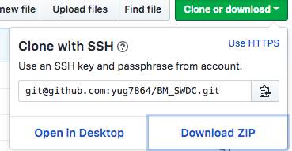

	- 다운받은 ZIP 파일의 압축을 풀어주세요	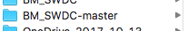
	- Android Studio 초기화면 에서 "Open an existing Android Studio project"을 통해 프로젝트 파일을 열어주세요.  
	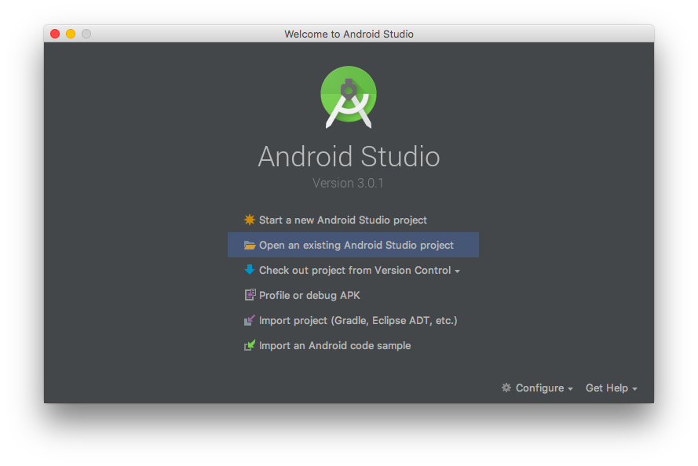
	- Android Studio 에 프로젝트 파일을 열때 필요한 업데이트가 있다면 업데이트를 해야 합니다. 
	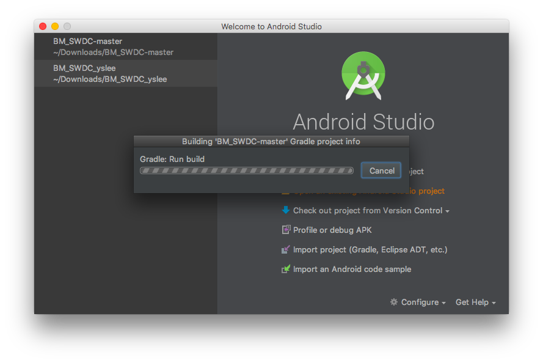
	- 프로젝트 파일이 열리면 상단의 Build 탭 - Make Build 를 클릭하여 프로젝트 파일을 Build 해 주십시요 
	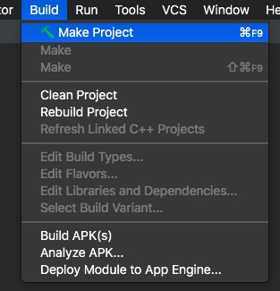
	- 프로젝트 파일 Build 가 완료되면 축하드립니다. 이제부턴 프로젝트 파일을 사용하실 수 있습니다.
	
2. Home IoT System 설정 방법 입니다. 
	- APM 환경 설정이 먼저 해주셔야 합니다. 
	- BM_SWDC-master(Project Root)/app/src/main/java/com/example/yug08 의 경로에 들어가시면 "ETC" 디렉토리가 존제 합니다.
	 해당 디렉토리 하부에 Arduino(HW_ardu) , Python(Use_Code) , PHP(BM) code 를 보관 하였습니다.
	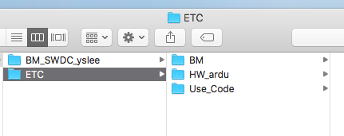
	- ETC 디렉토리 안의 "BM" 디렉토리를 복사하여 라즈베리파이의 var/www/html/ 경로로 복사해 주세요. ( 만약 실행이 안된다면 파일 권한을 변경하시기 바랍니다.)
	- 보고서의 HW 센서를 제작한뒤 "ETC" 디렉토리의 "HW_ardu" 디렉토리의 "Lamp_swit.ino" 는 전등 스위치
	- "Win_check.ino" 는 창문 스위치로 "Arduino IDE" 를 사용하여 컴파일후 업로드를 해주세요.
	- 두개의 HW에 업로드가 완료되면 전원을 넣어 HW를 작동시켜 주십시오.
	- HW에 전원이 들어온것을 확인하시면 "ETC" 디렉토리의 "Use_Code"디렉토리 안에 있는 [LampSwit_final.py 및 winCheck_final.py] 두 파일을 Python 3.4 version 을 사용해 실행하여 주십시오.
	
	
축하드립니다. 이 모든 과정을 무사히 마치셨다면 여러분은 외부 에서 IP 번호를 사용하여 전등을 끄거나! 켤수 있습니다. 
혹은 외출모드를 사용하여 방문자를 확인 할수도 있습니다. 
	 

Android App 설명서 입니다. 

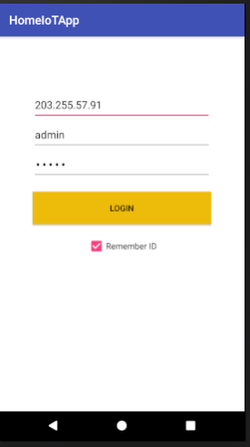

- 사용을 권장하는 IP : 203.255.57.91 , ID : admin , PW : admin
- 로그인 화면 입니다. Remember ID 체크 박스를 체크 하시면 로그인 성공 이후 다음 로그인은 자동으로 진행되게 됩니다. 
- 다른 ID를 사용 하시길 원하시면 안드로이드 백 버튼을 눌려 뒤로 가셔서 바꿔주실수 있습니다. 

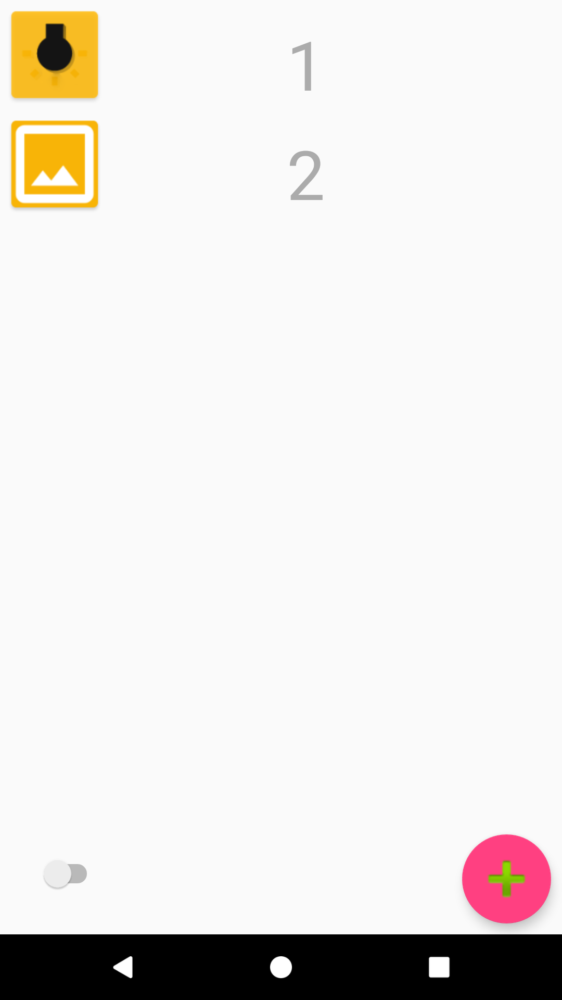

- 로그인시 만나게 되는 메인 화면 입니다.
- 상단의 아이콘이 전등 하단의 아이콘이 창문 아이템 입니다. 
- 아이템을 오른쪽으로 밀게 되시면 붉은색 과 함께 아이템이 삭제 되게 됩니다.
- 아이템을 왼쪽으로 밀게 되시면 회색 과 함께 아이템의 닉네임을 변경할 수 있습니다. 
- 왼쪽 하단의 토글 스위치 아이콘을 클릭하시면 스위치가 움직이며 "외출모드" 실행 하실 수 있습니다.
- 오른쪽 하단의 붉은 원형 버튼을 클릭 하시면 새로운 아이템을 추가 하실 수 있습니다. 

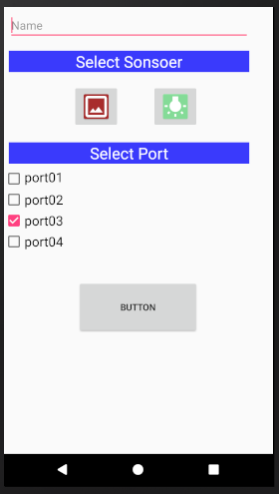

- 오른쪽 하단의 붉은 원형 버튼을 클릭하신이후 화면 입니다.
- 추가하실 아이템의 닉네임,종류,port번호 를 설정하실수 있습니다.
- 아이템 설정을 마치신부 버튼을 클릭을 하시면 아이템을 추가하실수 있습니다. 

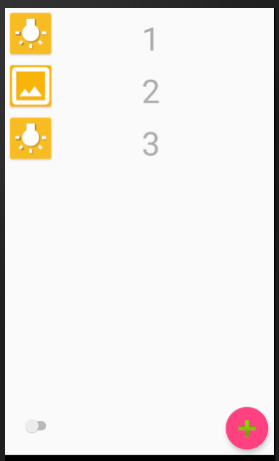

- 전등 아이템을 추가한 모습 입니다. 

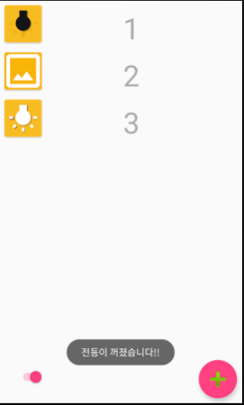

- 외출 모드를 설정하고 전등을 수동으로 변경했을때 알람이 오는 것을 확인 하실 수 있습니다. 
